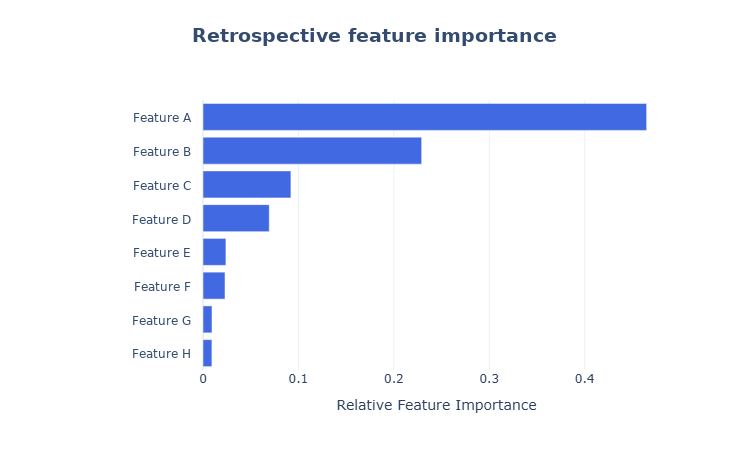
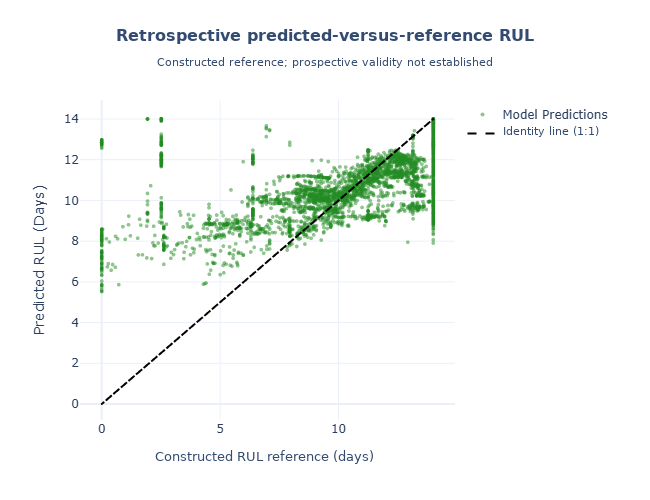
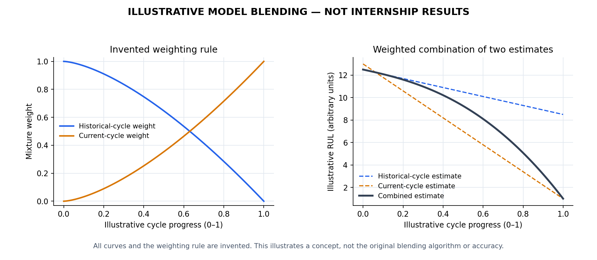

# Predictive Maintenance of Rotating Equipments

### An anonymized internship proof of concept in equipment-health analysis and RUL modeling

An internship project connecting industrial telemetry and maintenance history to study equipment degradation and build a remaining-useful-life (RUL) regression prototype.

**My contribution:** I carried the proof of concept from asset selection and data integration through operating-cycle analysis, feature engineering, modeling, and retrospective evaluation. I presented it to the company's C-suite and global reliability and maintenance leaders.

**The central lesson:** agreement with a constructed RUL reference target does not establish reliable failure prediction. Evaluating the period closest to failure exposed weaknesses that overall metrics concealed.

This is an independently written, anonymized portfolio account based on my internship summary. The two retrospective figures below preserve relationships from the original proof of concept, with internal feature labels removed and reference-target wording corrected. Raw datasets, internal code, model artifacts, maintenance records, slides, and operational identifiers are excluded. The original implementation and results cannot be independently reproduced from this repository.

## Work at a glance

| Area | What I contributed | Why it mattered |
| --- | --- | --- |
| Problem definition | Selected a maintenance-relevant asset and framed an equipment-reliability use case | Connected model development to a practical engineering question |
| Data engineering | Built a Python and cloud-warehouse pipeline joining sensor readings with enterprise maintenance records | Created a shared analytical view of equipment behavior and maintenance history |
| Time-series analysis | Resampled irregular telemetry, handled missingness, separated running and idle periods, and organized maintenance-related cycles | Made operating context explicit before modeling |
| Feature engineering | Developed baseline comparisons, a sensor-derived health index, rolling statistics, trends, and operating-state features | Translated raw measurements into indicators of asset condition |
| Machine learning | Developed Random Forest RUL regression with cross-cycle, current-cycle, and combined prediction strategies | Explored how historical experience and local operating behavior could complement each other |
| Evaluation | Examined overall and near-failure errors, target validity, and systematic overprediction | Identified limitations relevant to maintenance decisions |
| Communication | Presented the proof of concept to C-suite and global reliability and maintenance leaders; recommended stronger records, timestamp alignment, and broader validation | Explained technical findings and validation priorities to senior decision-makers |
| Applied LLM work | Refined classification prompts for a separate enterprise message-filtering workflow | Applied prompt engineering to an operational use case |

## Conceptual workflow

1. Combine sensor readings and maintenance history.
2. Build temporal features and RUL regression models.
3. Evaluate errors, especially near failure.

## Modeling and evaluation figures

**Feature importance.** Generic labels A–H replace internal channel names. The original rankings, bar lengths, and numerical scale are retained. This is a retrospective, model-specific ranking; it does not establish causal influence or feature stability across assets. The exact importance estimator has not been independently verified.

**Predicted versus reference RUL.** Points and scales are unchanged from the original figure. The x-axis represents a constructed RUL reference, not independently verified true remaining life. Overprediction is visible where reference values are low, reinforcing the need to evaluate near-failure behavior separately. This comparison does not establish prospective failure prediction or an operational warning horizon.

The figures retain original retrospective results; they are not synthetic. Label redaction does not remove those numerical relationships. [Publication scope and provenance](docs/disclosure.md) document the distinction.

### Model blending (illustrative)

This independently created illustration shows how changing mixture weights can combine historical-cycle and current-cycle estimates. All curves and the weighting rule are invented; the figure does not reproduce the internship algorithm or its performance. See the [modeling methodology](docs/methodology.md#illustrative-model-blending) for interpretation and regeneration instructions.

## Achievements and boundaries

I delivered an integrated analytical foundation, identified a promising vibration-based degradation indicator, developed a complementary set of regression strategies, and communicated limitations and data-improvement priorities. Retrospective results showed that performance weakened near failure, including overprediction of the reference RUL.

This account makes no claim of production deployment, verified warning lead time, reduced downtime, cost savings, or measured improvement from the LLM contribution. Apart from the relationships visible in the two figures above, internal numerical summaries and event details are omitted. The project is best understood as a prototype and an exercise in evidence-driven evaluation.
