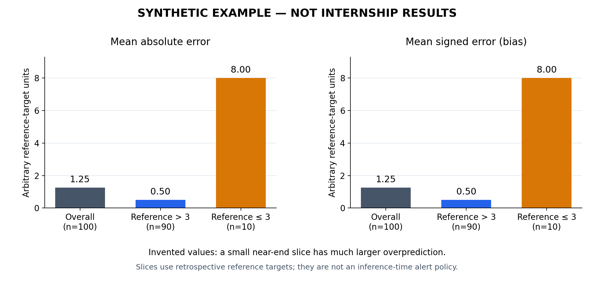

# Synthetic evaluation example

This independent educational example uses invented reference targets and predictions. It demonstrates evaluation slicing; it does not reproduce internship data, train a model, or establish a warning horizon.

Run with Python 3.9 or later. No third-party packages, API keys, or network connections are required:

```bash
python3 examples/evaluation_slices.py
```

The fixture deliberately includes more rows in an earlier lifecycle region. Each of those rows has a small positive error. A smaller near-end region has a much larger positive error. The program reports MAE, RMSE, bias, and sample counts, and verifies the weighted-MAE decomposition.

Expected output:

```text
SYNTHETIC ONLY: invented values; no company data or model results.
slice             n   MAE    RMSE   bias
overall         100   1.25   2.59   1.25
reference > 3    90   0.50   0.50   0.50
reference <= 3   10   8.00   8.06   8.00
Weighted-MAE decomposition: verified.
```

These illustrative values are deliberately chosen and support no empirical conclusion. Slice membership uses a retrospective reference target, which may be unavailable at inference time. A deployed alert must operate on information available when the decision is made.

## Optional plot



The plot uses the same `invented_rows()` fixture as the standard-library example. Both axes use arbitrary reference-target units; no company values, image pixels, timestamps, or internal results are used. MAE and mean signed error coincide here because all deliberately invented errors are positive. This is a teaching example, not evidence of model accuracy or operational safety.

To regenerate the figure, install the optional `matplotlib` dependency (the published figure was rendered with version 3.10.1), then run:

```bash
python3 examples/plot_evaluation_slices.py
```

The conceptual README diagram is also an independently authored reconstruction at a generic level, not an internal architecture artifact.

## Model-blending illustration

An additional [synthetic model-blending figure](../docs/figures/illustrative-model-blending.png) illustrates a two-predictor mixture with wholly invented estimates and weights. It uses no company data or original image pixels. The rule is not the original adaptive algorithm and makes no performance claim.

With the optional matplotlib dependency installed, regenerate it with:

```bash
python3 examples/plot_model_blending.py
```
